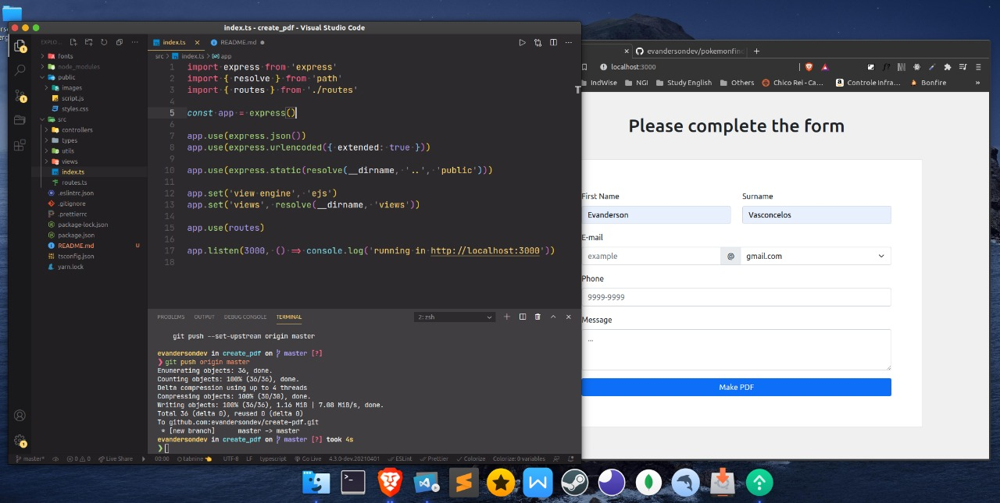
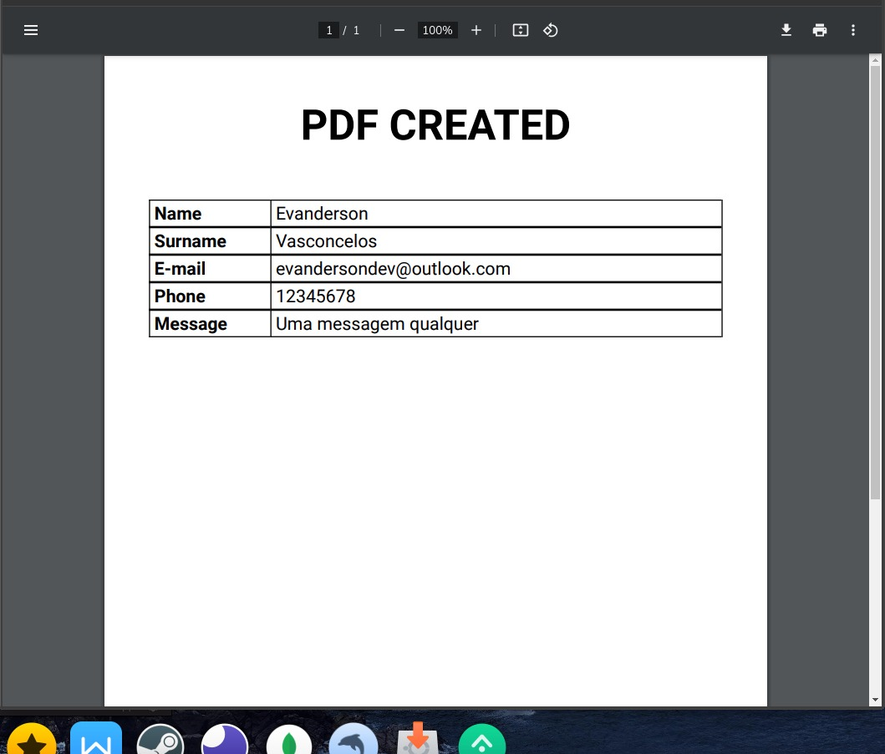

<h1 align="center">

PDF CREATOR

</h1>
 
 
  

  
 
 
 

Project based of the course Fullstack Master at DevPleno

  

### Getting started

- In your terminal, run the steps:

> `git clone https://github.com/evandersondev/create-pdf pdf-creator`

> `cd pdf-creator`

> `yarn` or `npm install` **for install the modules**.

> `yarn start` or `npm run start`.

> You can access in your browser the web application http://localhost:3000.

## Features

Features/Packages used in the Project.

- NodeJS
- Typescript
- EJS
- Bootstrap

### - LICENSE

This project is licensed under the MIT License - see the <a href="https://opensource.org/licenses/MIT" target="_blank">LICENSE</a> page for details.
